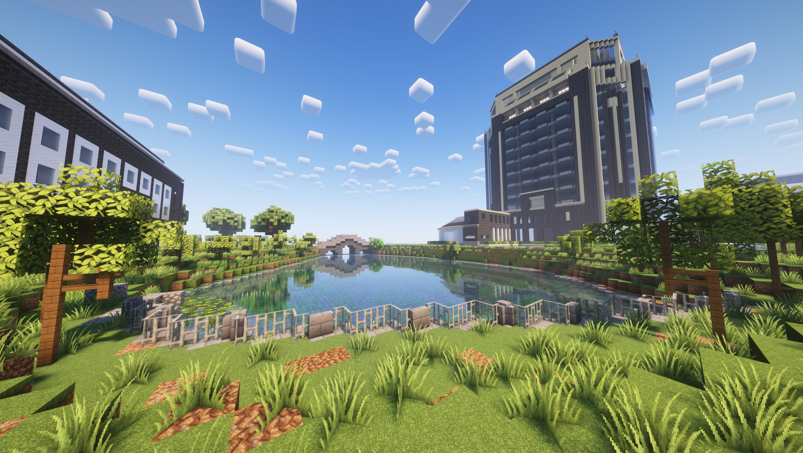
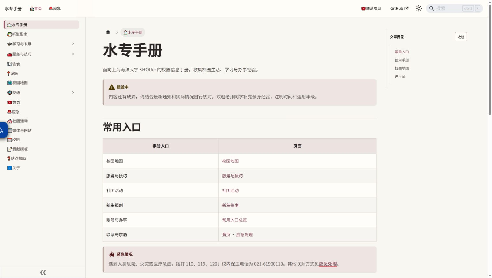
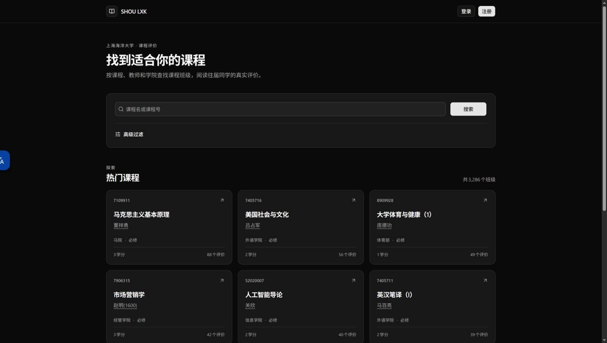

  

<h1 align="center">潮涌核心社 · SHOU Minecraft</h1>

  <strong>生存共建 · 创造建筑 · 校园漫游</strong> 
  记录我们一起建造的世界，也分享海大同学用得上的校园资源。

  
  

  
  
  
  
  

  <a href="https://www.shoumc.com/servers/">服务器介绍</a> ·
  <a href="https://www.shoumc.com/community/">社团资源</a> ·
  <a href="https://www.shoumc.com/updates/">更新日志</a> ·
  <a href="https://map.shoumc.com/">在线地图</a>

<em>SHOU 校园湖畔 · 点击图片，进入 BlueMap 漫游。</em>

## 一起建造，也一起记录

从 SMP 的多人生存，到 Create 的自由建筑，再到 SHOU 的校园展示，这里记录服务器介绍、命令说明与更新日志，让新成员找到入口，也让共同完成的作品留下档案。

| 官网 | 文档镜像 | GitHub Pages | 加入交流 |
| --- | --- | --- | --- |
| [www.shoumc.com](https://www.shoumc.com/) | [wiki.shoumc.com](https://wiki.shoumc.com/) | [conduit-club.github.io](https://conduit-club.github.io/) | [Discord](https://discord.gg/knvDenYF5Y) |

## 海大校园资源

### 水专手册

校园生活与学习资料，供新同学查阅，也由同学持续补充。

[阅读手册](https://manual.shoumc.com/) · [项目仓库](https://github.com/Conduit-Club/SHOU-Online-Manual)

### 今日海大吃什么

查找校园与周边餐饮，浏览店铺与餐品，分享自己的用餐推荐。

[今天吃什么](https://eat.shoumc.com/) · [项目仓库](https://github.com/Conduit-Club/what-to-eat-in-shou-today-done-right)

### 来选课

查询课程与教师评价。在线服务由其他维护者维护，社团提供访问入口与相关分析、归档资料；登录和注册进入原站认证。

[查找课程](https://lxk.shoumc.com/) · [原站](https://lxk.aaron212.com/) · [相关资料仓库](https://github.com/Conduit-Club/StructureAnalysis-shou-laixk)

校园资源截图拍摄于 2026-10-02，内容以各网站当前页面为准。图片来源说明见 [图片索引](assets/img/README.md)。

---

发现文档错误或过时链接？欢迎 [提交问题](https://github.com/Conduit-Club/Conduit-Club.github.io/issues) 或补充资料。
